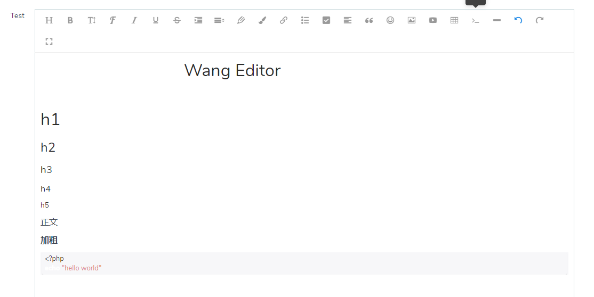

# Dcat Admin Form WangEditor扩展 拖拽上传,复制上传

## 部分代码参考[dcat-markdown](https://gitee.com/-/ide/project/dcat-phper/dcat-markdown)

## [WangEditor文档](https://www.wangeditor.com/doc/)
## 示例

---



---

# 安装和使用
## composer 安装

---
```shell
composer require death_satan/dcat-wang-editor -vvv
```
---
## 使用
## 在form中使用

---
```php
/**
* @var $form \Dcat\Admin\Form
 */
$form->wangEditor('column')
```
---


# 所有的配置参数请参考官方参数,本扩展只做了极小的兼容性处理
## 建议使用phpstorm编辑器,并且安装扩展后运行 `php artisan admin:ide` 命令生成ide提示文件
## 已开放的接口

<table border="2">
  <tr>
    <th>方法名</th>
    <th>参数</th>
    <th>说明</th>
    <th>示例</th>
  </tr>
  <tr>
    <td>colors</td>
    <td>array $colors</td>
    <td>配置颜色（文字颜色、背景色）</td>
    <td><a href="https://www.wangeditor.com/doc/pages/03-%E9%85%8D%E7%BD%AE%E8%8F%9C%E5%8D%95/02-%E9%85%8D%E7%BD%AE%E9%A2%9C%E8%89%B2.html">官方文档</a></td>
  </tr>
  <tr>
    <td>height</td>
    <td>int $height</td>
    <td>设置编辑器容器高度</td>
    <td>参考WangEditor文档</td>
  </tr>
  <tr>
    <td>emotions</td>
    <td>array $emotions</td>
    <td>配置表情图标</td>
    <td><a href="./example/emotions.md">emotions示例</a></td>
  </tr>
  <tr>
    <td>Menu</td>
    <td>array $data</td>
    <td>定义显示哪些菜单和菜单的顺序</td>
    <td><a href="https://www.wangeditor.com/doc/pages/03-%E9%85%8D%E7%BD%AE%E8%8F%9C%E5%8D%95/01-%E8%87%AA%E5%AE%9A%E4%B9%89%E8%8F%9C%E5%8D%95.html">
        官方文档地址(json换成数组传入即可)</a></td>
  </tr>
  <tr>
    <td>ExcludeMenus</td>
    <td>array $data</td>
    <td>剔除少数菜单</td>
    <td><a href="https://www.wangeditor.com/doc/pages/03-%E9%85%8D%E7%BD%AE%E8%8F%9C%E5%8D%95/01-%E8%87%AA%E5%AE%9A%E4%B9%89%E8%8F%9C%E5%8D%95.html">
        官方文档地址(json换成数组传入即可)</a></td>
  </tr>
  <tr>
    <td>zIndex</td>
    <td>int $zIndex</td>
    <td>配置 z-index</td>
    <td>参考WangEditor文档</td>
  </tr>
  <tr>
    <td>focus</td>
    <td>bool $focus=false</td>
    <td>自动 focus</td>
    <td><a href="https://www.wangeditor.com/doc/pages/01-%E5%BC%80%E5%A7%8B%E4%BD%BF%E7%94%A8/08-%E8%87%AA%E5%8A%A8focus.html">
        官方文档</a></td>
  </tr>
  <tr>
    <td>showFullScreen</td>
    <td>bool $show=false</td>
    <td>设置全屏功能</td>
    <td>参考WangEditor文档</td>
  </tr>
  <tr>
    <td>showMenuTooltips</td>
    <td>bool $show=false</td>
    <td>设置菜单栏提示</td>
    <td>参考WangEditor文档</td>
  </tr>
  <tr>
    <td>menuTooltipPosition</td>
    <td>string $position = 'down'</td>
    <td>设置菜单栏提示为[下标:up,下标:down]</td>
    <td>参考WangEditor开发文档</td>
  </tr>
  <tr>
    <td>pasteFilterStyle</td>
    <td>bool $state = false</td>
    <td>关闭粘贴样式的过滤</td>
    <td>同上</td>
  </tr>
  <tr>
    <td>pasteIgnoreImg</td>
    <td>bool $ignore=true</td>
    <td>忽略粘贴内容中的图片</td>
    <td>同上</td>
  </tr>
  <tr>
    <td>disk</td>
    <td>string $disk = 'local'</td>
    <td>设置文件驱动</td>
    <td>config/filesystems.php里面设置的disk</td>
  </tr>
  <tr>
    <td>ImgDirectory</td>
    <td>string $path</td>
    <td>设置图片上传路径</td>
    <td>...</td>
  </tr>
  <tr>
    <td>VideoDirectory</td>
    <td>string $path</td>
    <td>设置视频上传路径</td>
    <td>...</td>
  </tr>
  <tr>
    <td>setCss</td>
    <td>string $css</td>
    <td>设置highlight的样式css名</td>
    <td><a href="./example/setCss.md">示例</a></td>
  </tr>
  <tr>
    <td>lang</td>
    <td>string $lang='en'</td>
    <td>设置语言</td>
    <td>目前官方默认可选的只有 zh-CN en</td>
  </tr>
</table>
